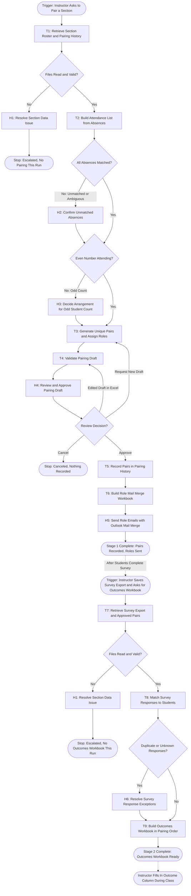

# Workflow of Tasks

## 1. Workflow Overview
### 1.1 Workflow Goal
This workflow supports the system goal defined in `negotiation_agent/README.md`.

### 1.2 Workflow Trigger

The workflow has two stages, each started manually by the Instructor in the Claude desktop app:

- **Stage 1 (Pairing)** starts when the Instructor asks the agent to pair a section for a simulation, usually before the class session in which the negotiation takes place, and lists any absent students.
- **Stage 2 (Survey Data)** starts when the Instructor has saved the Qualtrics survey export into that simulation's folder and asks the agent to build the outcomes workbook.

Stage 2 for a simulation can only run after Stage 1 for the same section and simulation has been approved.

### 1.3 Completion Condition at Runtime

Stage 1 is complete when the Instructor has approved the pairing, the new pairs have been recorded in the section's Pairing History workbook, and the Role Mail Merge workbook is ready for her Outlook mail merge. Stage 2 is complete when the Outcomes workbook has been built in pairing order with every attending student's survey data copied exactly, and the outcome column is left blank for the Instructor to fill in during class.

### 1.4 General Workflow

All records live in Excel workbooks in one course folder on the Instructor's computer. A **Simulation Settings** workbook at the top of the folder has one row per simulation: simulation name, roles, role information (text or a link to the role document), survey link, survey column mapping (which Qualtrics column holds which number), and the outcomes template file. Each section has its own folder containing its **Roster**, its **Pairing History** (the Instructor's existing pair-ID spreadsheet), a **Run Log**, a **Backups** folder, and one subfolder per simulation run. Unique pairs are tracked separately for each section. Every task writes a plain-language entry to the section's Run Log, and every write to an existing workbook is preceded by a dated backup copy.

```
Negotiation Pairing Solution/
├── Simulation Settings.xlsx
├── Templates/
│   └── Used Car Outcomes Template.xlsx
└── <Term> Section <NN>/
    ├── Roster.xlsx
    ├── Pairing History.xlsx
    ├── Run Log.xlsx
    ├── Backups/
    └── <Simulation> <YYYY-MM-DD>/
        ├── Pairing Draft.xlsx
        ├── Role Mail Merge.xlsx
        ├── Survey Export.csv
        └── Outcomes.xlsx
```

**Stage 1 (Pairing).** **T1: Retrieve Section Roster and Pairing History** reads the section's roster, its pairing history, and the simulation's settings. **T2: Build Attendance List from Absences** matches the absences the Instructor listed to roster students and produces the list of students to pair. **T3: Generate Unique Pairs and Assign Roles** pairs the attending students so that no two partners already share a pair ID, and assigns roles so each pair has one of each role. **T4: Validate Pairing Draft** checks the draft against fixed rules and saves it as the Pairing Draft workbook with any warnings. In **H4: Review and Approve Pairing Draft**, the Instructor reviews the draft. She can approve it, edit it directly in Excel, ask for a new draft, or cancel. Edited drafts go back through T4 so she can see the effect of her changes before approving. After approval, **T5: Record Pairs in Pairing History** writes the new pair IDs into the Pairing History workbook, and **T6: Build Role Mail Merge Workbook** creates one row per student with their role information for her Outlook mail merge. The Instructor then performs **H5: Send Role Emails with Outlook Mail Merge** herself.

**Stage 2 (Survey Data).** **T7: Retrieve Survey Export and Approved Pairs** reads the Qualtrics export and the approved pairing for this simulation. **T8: Match Survey Responses to Students** matches each survey row to a paired student by student ID. Students with no response are kept and marked, not dropped. **T9: Build Outcomes Workbook in Pairing Order** fills the simulation's outcomes template with one row per student in pairing order, copies each student's survey numbers exactly, and leaves the outcome column blank. The Instructor fills in outcomes during class. Stage 2 should take no more than 10 minutes from start to finished workbook.

**Exception paths.** If a required file cannot be read, is missing, or is not in the expected format, the run stops and the Instructor performs **H1: Resolve Section Data Issue**; no draft or workbook is produced from missing data. If an absence cannot be matched to exactly one roster student, the Instructor performs **H2: Confirm Unmatched Absences** before T3 runs; nobody is excluded on a guess. If the number of attending students is odd, the Instructor performs **H3: Decide Arrangement for Odd Student Count** before T3 runs. If T3 cannot avoid every repeat partner, the draft includes the fewest possible repeats, each clearly flagged for her decision in H4. If T8 finds duplicate responses or responses from students who are not in the approved pairing, the Instructor performs **H6: Resolve Survey Response Exceptions** before T9 runs. If any other task fails, times out, or has an uncertain outcome, the run stops at that task, records the status in the Run Log, and tells the Instructor in the chat what happened. No partial file is presented as finished.

**Human checkpoints.** Nothing is recorded in Pairing History until the Instructor approves a pairing in H4, and no email reaches students unless she sends it herself in H5. If she leaves without deciding, nothing is recorded; the run can be resumed from the Run Log or started again.

### 1.5 Workflow Diagram



## 2. Task Index

| ID | Task | Type | Owner | Stage |
|---|---|---|---|---|
| T1 | [Retrieve Section Roster and Pairing History](task-specs/retrieve-section-roster-and-pairing-history.md) | Retrieve | Agent | 1 |
| T2 | [Build Attendance List from Absences](task-specs/build-attendance-list-from-absences.md) | Reason | Agent | 1 |
| T3 | [Generate Unique Pairs and Assign Roles](task-specs/generate-unique-pairs-and-assign-roles.md) | Reason | Agent | 1 |
| T4 | [Validate Pairing Draft](task-specs/validate-pairing-draft.md) | Verify | Agent | 1 |
| T5 | [Record Pairs in Pairing History](task-specs/record-pairs-in-pairing-history.md) | Remember | Agent | 1 |
| T6 | [Build Role Mail Merge Workbook](task-specs/build-role-mail-merge-workbook.md) | Act | Agent | 1 |
| T7 | [Retrieve Survey Export and Approved Pairs](task-specs/retrieve-survey-export-and-approved-pairs.md) | Retrieve | Agent | 2 |
| T8 | [Match Survey Responses to Students](task-specs/match-survey-responses-to-students.md) | Reason | Agent | 2 |
| T9 | [Build Outcomes Workbook in Pairing Order](task-specs/build-outcomes-workbook-in-pairing-order.md) | Act | Agent | 2 |
| H1 | [Resolve Section Data Issue](task-specs/resolve-section-data-issue.md) | Verify | Instructor | 1, 2 |
| H2 | [Confirm Unmatched Absences](task-specs/confirm-unmatched-absences.md) | Decide | Instructor | 1 |
| H3 | [Decide Arrangement for Odd Student Count](task-specs/decide-arrangement-for-odd-student-count.md) | Decide | Instructor | 1 |
| H4 | [Review and Approve Pairing Draft](task-specs/review-and-approve-pairing-draft.md) | Verify | Instructor | 1 |
| H5 | [Send Role Emails with Outlook Mail Merge](task-specs/send-role-emails-with-outlook-mail-merge.md) | Act | Instructor | 1 |
| H6 | [Resolve Survey Response Exceptions](task-specs/resolve-survey-response-exceptions.md) | Decide | Instructor | 2 |
