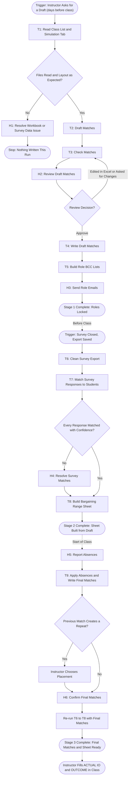

# Workflow of Tasks

## 1. Workflow Overview
### 1.1 Workflow Goal
This workflow supports the system goal defined in `negotiation_agent/README.md`. It covers the Used Car simulation; other two-role simulations will reuse it once their tab templates and surveys are added.

### 1.2 Workflow Trigger

The workflow has three stages, each started by the Instructor in the Claude desktop app:

- **Stage 1 (Draft):** a few days before class, she asks Claude to draft the matches for a simulation, optionally naming students she already knows will be absent. Skill: `negotiation-pairing`.
- **Stage 2 (Bargaining sheet):** after the survey closes, a few hours before class, she saves the Qualtrics export and asks Claude to build the bargaining range sheet. Skill: `bargaining-range-sheet`.
- **Stage 3 (Absences):** at the start of class, she tells Claude who is absent. Skill: `negotiation-pairing`, followed by a quick re-run of `bargaining-range-sheet`.

### 1.3 Completion Condition at Runtime

Stage 1 is complete when the draft matches are in the simulation tab's draft table and the BCC lists are ready. Stage 2 is complete when the bargaining range sheet is built from the draft matches. Stage 3 is complete when the final matches (with `_0` for absent students) are in the simulation tab's final table and the bargaining range sheet has been rebuilt from them. The workflow for a simulation ends when the Instructor fills in `ACTUAL IO` and `OUTCOME` during class, which stays manual.

### 1.4 General Workflow

All pairing records live in the Instructor's roster workbook, one tab per simulation, following [`docs/workbook-conventions.md`](../docs/workbook-conventions.md). The bargaining range sheet is a separate workbook saved next to the Qualtrics export. Every write is preceded by a backup in a `Backups` folder next to the file, and every action is recorded in `Negotiation Log.xlsx` next to the roster workbook, so her own workbook stays free of agent records.

**Stage 1 (Draft).**
- **T1: Read Class List and Simulation Tab** reads the class list from the attendance tab and the prepared simulation tab, plus the pair IDs on every earlier simulation tab.
- **T2: Draft Matches** applies her alphabetical method.
- **T3: Check Matches** confirms that every student appears once with one role, and warns about repeat partners from earlier simulations.
- **H2: Review Draft Matches** lets the Instructor approve the draft, edit it in Excel (re-checked by T3), or ask for changes.
- **T4: Write Draft Matches** fills the draft table of the simulation tab.
- **T5: Build Role BCC Lists** produces one email list per role.
- **H3: Send Role Emails** is hers: she sends each role its packet with her usual BCC emails. Once she confirms, roles are locked.

**Stage 2 (Bargaining sheet).**
- **T6: Clean Survey Export** normalizes the answers, fixing obvious typos and marking unclear answers.
- **T7: Match Survey Responses to Students** connects each response to a student in the current matches.
- **H4: Resolve Survey Matches** handles any response that cannot be matched with confidence.
- **T8: Build Bargaining Range Sheet** writes her mirrored, one-row-per-match layout.

**Stage 3 (Absences).**
- **H5: Report Absences:** the Instructor names the absent students.
- **T9: Apply Absences and Write Final Matches** gives absent students `_0`, moves each stranded partner into the previous match in the same role, re-checks the result with T3, and asks her to confirm.
- **H6: Confirm Final Matches.** Once she confirms, the final table is written. She then asks Claude to re-run Stage 2, which rebuilds the bargaining range sheet from the final matches in a minute or two.

**Exception paths.**
- If a file cannot be read, a tab is missing, or a tab doesn't match the expected layout, the run stops and the Instructor performs **H1: Resolve Workbook or Survey Data Issue**. Nothing is written from missing or misread data.
- If the class has more students than the prepared tab has match rows, T4 stops and asks her to extend the tab rather than writing outside it.
- If moving a stranded partner into the previous match would create a repeat partner, T9 asks her where the student should go instead.
- If any task fails, times out, or has an uncertain outcome, the run stops at that task, records the status in the log, and tells her in the chat. No partial file is presented as finished.

**Human checkpoints.**
- Nothing is written to the roster workbook until she approves the draft (H2) or the final matches (H6).
- No student is contacted except by her own emails (H3).
- No survey response is attached to a student on a guess (H4).

### 1.5 Workflow Diagram

## 2. Task Index

| ID | Task | Type | Owner | Skill |
|---|---|---|---|---|
| T1 | [Read Class List and Simulation Tab](task-specs/read-class-list-and-simulation-tab.md) | Retrieve | Agent | pairing |
| T2 | [Draft Matches](task-specs/draft-matches.md) | Reason | Agent | pairing |
| T3 | [Check Matches](task-specs/check-matches.md) | Verify | Agent | pairing |
| T4 | [Write Draft Matches](task-specs/write-draft-matches.md) | Remember | Agent | pairing |
| T5 | [Build Role BCC Lists](task-specs/build-role-bcc-lists.md) | Act | Agent | pairing |
| T6 | [Clean Survey Export](task-specs/clean-survey-export.md) | Reason | Agent | bargaining sheet |
| T7 | [Match Survey Responses to Students](task-specs/match-survey-responses-to-students.md) | Reason | Agent | bargaining sheet |
| T8 | [Build Bargaining Range Sheet](task-specs/build-bargaining-range-sheet.md) | Act | Agent | bargaining sheet |
| T9 | [Apply Absences and Write Final Matches](task-specs/apply-absences-and-write-final-matches.md) | Remember | Agent | pairing |
| H1 | [Resolve Workbook or Survey Data Issue](task-specs/resolve-workbook-or-survey-data-issue.md) | Verify | Instructor | both |
| H2 | [Review Draft Matches](task-specs/review-draft-matches.md) | Verify | Instructor | pairing |
| H3 | [Send Role Emails](task-specs/send-role-emails.md) | Act | Instructor | pairing |
| H4 | [Resolve Survey Matches](task-specs/resolve-survey-matches.md) | Decide | Instructor | bargaining sheet |
| H5 | [Report Absences](task-specs/report-absences.md) | Decide | Instructor | pairing |
| H6 | [Confirm Final Matches](task-specs/confirm-final-matches.md) | Verify | Instructor | pairing |
